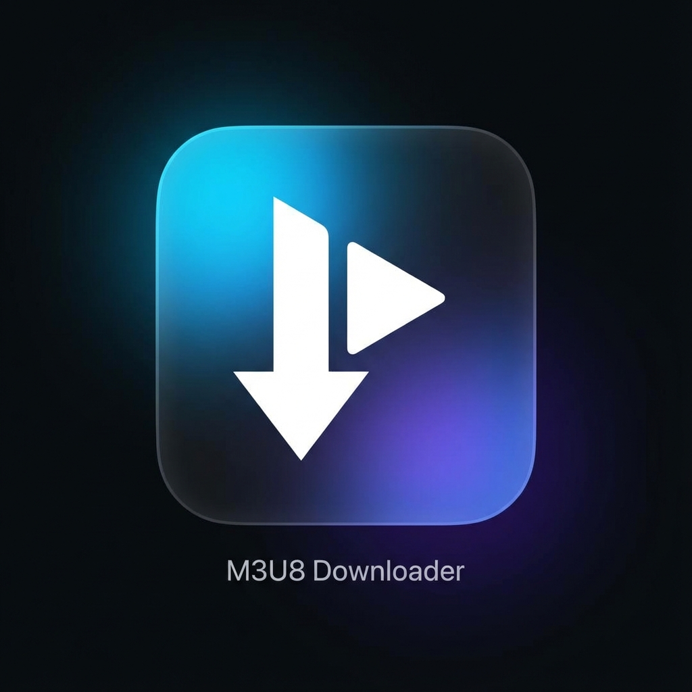

# M3U8 极速下载器 (M3U8 Downloader)



一款基于 Electron + React 开发的高性能 M3U8 视频下载工具。支持多任务并发、实时速度显示、自定义文件名及保存路径，并集成了 FFmpeg 自动合并功能。

## ✨ 功能特性

- **🚀 多任务并发**：支持同时下载多个 M3U8 视屏，独立进度条管理。
- **⚡ 实时测速**：实时显示当前下载速度 (KB/s, MB/s)。
- **📂 有序管理**：
  - **自定义文件名**：下载前指定文件名，或使用默认时间戳。
  - **动态重命名**：下载过程中（合并前）可随时点击标题修改文件名。
  - **自定义保存位置**：灵活选择文件保存目录。
- **🎥 自动合并**：下载完成后自动使用内置 FFmpeg 将 TS 分片合并为 MP4 文件。
- **🎨 现代界面**：玻璃拟态风格 UI，带有平滑动画和明亮动感的视觉效果。

## 🛠️ 技术栈

- **Frontend**: React, Vite, CSS Modules
- **Backend**: Electron, Node.js
- **Media Processing**: `fluent-ffmpeg`, `ffmpeg-static`, `m3u8-parser`
- **Network**: `axios`

## 📦 安装与运行

### 1. 克隆项目
```bash
git clone https://github.com/su469843/M3U8-Downloader.git
cd m3u8-downloader
```

### 2. 安装依赖
```bash
npm install
```

### 3. 开发模式运行
```bash
npm run electron:dev
```

### 4. 打包构建
为您的操作系统生成安装包：
```bash
npm run electron:build
```
构建产物将位于 `dist_electron` 目录。

## 🧩 项目结构

- `electron/` - Electron 主进程 (`main.js`) 和预加载脚本 (`preload.js`)。
- `src/` - React 前端代码 (`App.jsx`, `index.css`)。
- `build/` - 构建资源（如图标）。
- `.github/workflows/` - GitHub Actions 自动构建工作流。

## 📝 使用指南

1.  **输入链接**：在输入框中粘贴 M3U8 地址。
2.  **设置（可选）**：
    - 输入想要的文件名。
    - 点击文件夹图标选择保存位置（默认为系统“下载”文件夹）。
3.  **开始**：点击“开始下载”。
4.  **管理**：
    - 鼠标悬停在任务标题上点击 ✎ 可修改文件名。
    - 点击任务右下角的“显示日志”查看详细进度。
    - 下载完成后点击“打开文件”直接定位到视频。

## 📄 License

Apache-2.0
